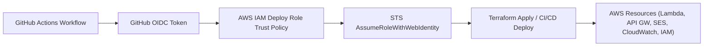

# waterapps-aws-bootstrap

Terraform that provisions the GitHub Actions OIDC identity provider and the scoped IAM deploy role used by all WaterApps CI/CD pipelines.

## Public Reference Notice

This repository is published as a generalized reference implementation for CI/CD bootstrap patterns. Details may be simplified or generalized to avoid exposing environment-specific operational information.

## Repository Metadata

- Standard name: `waterapps-10-bootstrap-oidc-iam`
- Depends on: none
- Provides: GitHub OIDC provider and AWS IAM deploy role for downstream repo CI/CD
- Deploy order: `10`

## Operational Docs

- `docs/LEARNINGS-2026-03-01.md` — lessons from first full bootstrap reconciliation
- `docs/BOOTSTRAP_RECONCILIATION_RUNBOOK.md` — step-by-step recovery and verification guide

## What it creates

| Resource | Name | Purpose |
|---|---|---|
| `aws_iam_openid_connect_provider` | GitHub OIDC | Lets GitHub Actions assume AWS roles without long-lived keys |
| `aws_iam_role` | `waterapps-prod-github-deploy` | Assumed by GitHub Actions workflows |
| `aws_iam_role_policy` | `waterapps-prod-deploy-permissions` | Least-privilege access for Lambda, API GW, IAM, SES, CloudWatch |

## OIDC Trust Flow (Mermaid)



## First-time setup (chicken-and-egg)

The workflow uses OIDC to authenticate, but the OIDC role doesn't exist yet on first run. Apply locally:

```bash
aws sso login --profile your-profile   # or export AWS_* env vars
cd terraform
terraform init
terraform plan
terraform apply
```

For team-safe ongoing changes, configure remote Terraform state (S3 + DynamoDB locking) before using the GitHub Actions `workflow_dispatch` plan/apply path. The workflow now requires remote state inputs and will block local-state execution in CI.

## GitOps Approval Flow (Recommended)

Current CI/CD flow:
- Push / PR: validate, OIDC preflight, tests, tfsec
- PR (optional): Terraform plan when OIDC + remote-state repo config is present
- Manual `workflow_dispatch`: plan/apply with `production` environment approval

Configure for PR plan + approved apply:

- Secret:
  - `AWS_DEPLOY_ROLE_ARN`
- Repo vars:
  - `BOOTSTRAP_TF_STATE_BUCKET`
  - `BOOTSTRAP_TF_STATE_KEY` (optional override; default: `bootstrap/terraform.tfstate`)
  - `BOOTSTRAP_TF_LOCK_TABLE`

Recommended GitHub settings:
- Branch protection on `main` (require PR + checks)
- `production` environment required reviewers (approval gate for apply)

Note: the very first bootstrap apply can still require a local run (OIDC chicken-and-egg), but subsequent changes should follow the GitOps flow above.

Copy the `deploy_role_arn` output, then:

1. Go to `github.com/water-apps/waterapps-contact-form` → **Settings → Environments → production**
2. Add secret `AWS_DEPLOY_ROLE_ARN` = the ARN from above
3. Repeat for any other repos listed in `var.github_repos`

Subsequent changes to this repo can then run via GitHub Actions.

## Adding a new repo

In `terraform/variables.tf`, add the repo name to `github_repos`:

```hcl
variable "github_repos" {
  default = ["waterapps-contact-form", "waterapps-new-service"]
}
```

Then `terraform apply`. No new role needed — the trust policy updates to include the new repo.

## Structure

```
terraform/
  main.tf        # OIDC provider + IAM role + inline policy
  variables.tf   # github_org, github_repos, common_tags, etc.
  outputs.tf     # deploy_role_arn
.github/workflows/
  apply.yml      # validate on PR; plan/apply on manual dispatch
```
