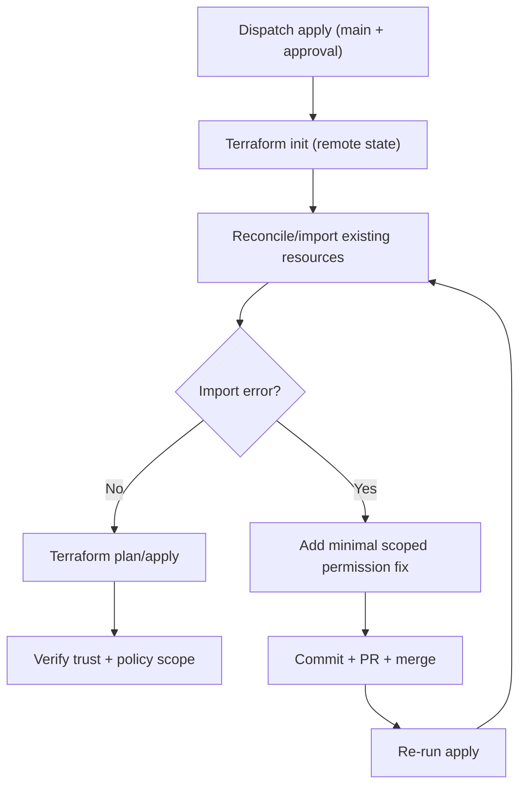

# Bootstrap Reconciliation Runbook

Use this when bootstrap apply fails because resources already exist or Terraform state is missing resources.

## Goal

Converge bootstrap infrastructure into Terraform-managed state safely, without widening permanent privileges beyond required scope.

## Reconciliation Flow

## Preconditions

1. Branch protection and required checks are active on `main`.
2. `production` environment requires reviewer approval.
3. Remote state inputs are provided:
   - `tf_state_bucket`
   - `tf_state_key`
   - `tf_lock_table`
4. `AWS_DEPLOY_ROLE_ARN` is configured in environment secrets.

## Standard Apply

Run GitHub workflow `apply.yml` with:

- `action=apply`
- `tf_state_bucket=<state-bucket>`
- `tf_state_key=<state-key>`
- `tf_lock_table=<lock-table>`

Approve pending deployment for `production` environment.

## If Reconcile Fails

1. Inspect failed step logs (`Reconcile existing bootstrap resources into state`).
2. Identify exact denied action and resource.
3. Add the smallest permanent permission needed in `terraform/main.tf`.
4. Open PR, pass checks, merge.
5. Re-run manual apply.
6. Repeat until reconcile + apply both succeed.

## Temporary Break-Glass Rule

Use only if bootstrap deadlocks and no successful apply path exists:

1. Add tightly scoped temporary inline policy to deploy role for the specific denied action/resource.
2. Complete one successful bootstrap apply after permanent code fix is merged.
3. Remove temporary policy immediately.
4. Confirm only expected long-term policies remain.

## Verification Checklist

After successful apply:

1. OIDC trust `sub` includes only approved repo subjects on:
   - `refs/heads/main`
   - `refs/tags/*`
   - `environment:production`
2. Inline policy allows required state operations only on configured state bucket/lock table.
3. No temporary inline policy remains.
4. Workflow run status is `completed/success`.

## Common Deny Patterns

- S3 bucket metadata reads during import:
  - `s3:GetBucketPolicy`
  - `s3:GetBucketAcl`
- DynamoDB metadata reads during import:
  - `dynamodb:DescribeContinuousBackups`

Prefer scoped wildcard families when provider metadata access is fragmented:

- `s3:GetBucket*`, `s3:PutBucket*`
- `dynamodb:Describe*`

Keep resource ARNs narrow.
